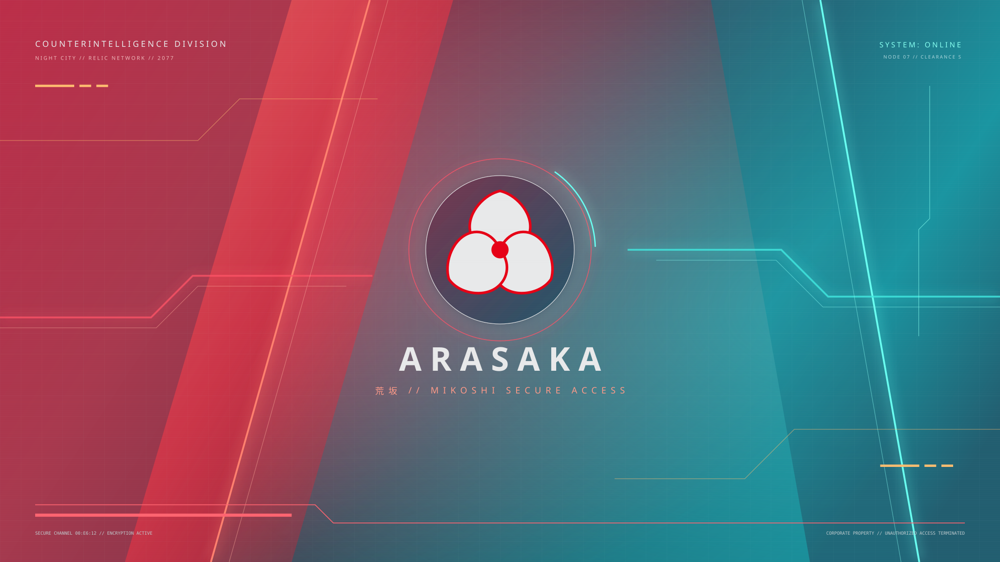
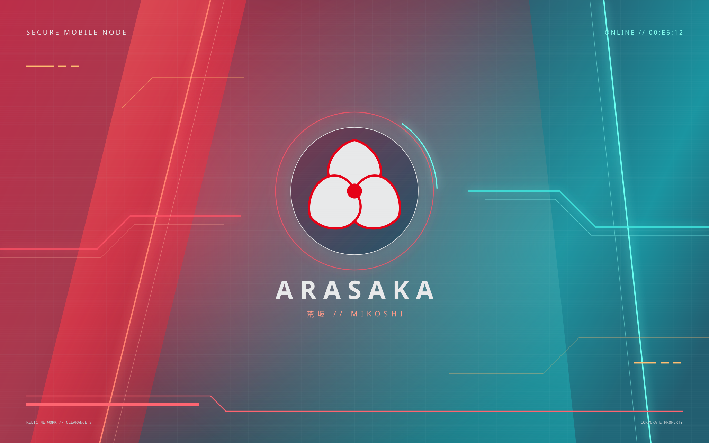
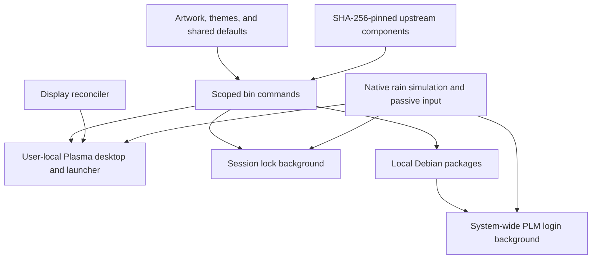

# Arasaka KDE

**A rain-soaked, neon-red desktop for KDE Plasma 6.**

[](https://github.com/sne11ius/arasaka-kde/actions/workflows/tests.yml)
[](https://github.com/sne11ius/arasaka-kde/actions/workflows/native.yml)
[](https://github.com/sne11ius/arasaka-kde/actions/workflows/docs.yml)
[](https://github.com/sne11ius/arasaka-kde/actions/workflows/links.yml)
[](https://github.com/sne11ius/arasaka-kde/actions/workflows/codeql.yml)
[](https://app.codecov.io/gh/sne11ius/arasaka-kde)
[](https://scorecard.dev/viewer/?uri=github.com/sne11ius/arasaka-kde)
[](https://github.com/sne11ius/arasaka-kde/actions/workflows/showcase.yml)

[](https://github.com/sne11ius/arasaka-kde/releases/latest)
[](LICENSE)
[](https://github.com/sne11ius/arasaka-kde/commits/main/)
[](https://github.com/sne11ius/arasaka-kde/graphs/contributors)
[](https://github.com/sne11ius/arasaka-kde)
[](https://github.com/sne11ius/arasaka-kde/forks)
[](https://github.com/sne11ius/arasaka-kde/issues)
[](https://github.com/sne11ius/arasaka-kde/pulls)

<!-- showcase:start -->
<!-- markdownlint-disable MD034 -->

https://github.com/user-attachments/assets/7d40ffa4-6c69-444f-8f1f-3c3c5b100f24

<!-- markdownlint-enable MD034 -->

[Watch/download the high-quality film](https://github.com/sne11ius/arasaka-kde/releases/tag/showcase-640d26333fd2) · [Recorded source `640d263`](https://github.com/sne11ius/arasaka-kde/commit/640d26333fd2668b17a8b316ec7509c416b74285)

*A real login-to-desktop session, recorded automatically in a disposable VM.*
<!-- showcase:end -->

<p align="center">
  <a href="#-the-desktop">Explore</a> ·
  <a href="#-getting-started">Get started</a> ·
  <a href="docs/README.md">Read the docs</a> ·
  <a href="https://github.com/sne11ius/arasaka-kde/releases">Releases</a> ·
  <a href="https://github.com/sne11ius/arasaka-kde/issues/new/choose">Get involved</a>
</p>

[How the showcase is recorded →](docs/showcase.md) · [What the badges measure →](docs/automation.md#badge-directory)

## ✨ The desktop

Welcome to your little corner of Night City. Arasaka KDE brings together original
artwork, a coherent dark palette, native Plasma components, and a surprisingly
tactile sheet of rain. The goal is a desktop that feels as good to use as it looks.

This repository is the source of truth for the setup: assets, pinned upstream
components, local adaptations, and the commands that put them together.

| Detail | What you get |
| --- | --- |
| **Rain you can touch** | Native droplets fall, merge, refract the artwork, and leave wet trails. Hover to influence them; click a drop to splash it. |
| **One background experience** | Shared artwork, physics, speed, quality, hover, and click effects across desktop, session lock, and PLM login. |
| **A quieter workspace** | A search-first launcher with native Kickoff and system tray integration, without managed panels or edge rails. |
| **Windows that find their place** | Automatic binary-tree tiling, 8 px gaps, keyboard navigation, and dragging between displays. |
| **A little theatrical flair** | TV Glitch for window transitions, with shorter animations for popups and menus. |
| **A coordinated palette** | Plasma, Klassy, Kvantum, Konsole, GTK accents, browser chrome, and a Zsh prompt overlay. |
| **Multi-display care** | External-preferred primary-display selection, layout reconciliation, and wallpaper initialization for newly available desktops. |
| **Traceable ingredients** | SHA-256-pinned upstream downloads, explicit adaptation patches, and component-specific backups. |

> [!NOTE]
> The documented deployment target is **TUXEDO OS on Debian testing/forky,
> amd64, Plasma 6.7, Wayland**. This is an opinionated desktop setup; the
> [compatibility guide](docs/installation.md#compatibility) explains the boundaries.

<details>
<summary><strong>Take a closer look at the artwork</strong></summary>

| Widescreen · 16:9 | Laptop · 16:10 |
| --- | --- |
| [](assets/wallpapers/mikoshi-16x9.svg) | [](assets/wallpapers/mikoshi-16x10.svg) |

Both are editable SVG sources. The installer renders the PNG textures used by
the shader and static fallback. These previews show the artwork itself; rain,
fog, refraction, and window effects are rendered by Plasma at runtime.

</details>

## 🚀 Getting started

### 1. Get the source

```sh
git clone https://github.com/sne11ius/arasaka-kde.git
cd arasaka-kde
```

`main` contains current development. [Tagged releases](https://github.com/sne11ius/arasaka-kde/releases)
are source snapshots; `v0.1.0` predates several features described here and has no
prebuilt binary attachments.

### 2. Prepare your Plasma session

Follow the [installation guide](docs/installation.md) for the required fonts,
themes, KDE tools, and build dependencies. Full dependency provisioning is still
on the roadmap.

### 3. Apply the desktop

Run inside the target Plasma session **as your normal desktop user**:

```sh
./bin/apply-live
```

This installs and configures the desktop, including its shader and lock-screen
background. The [PLM login setup](docs/login.md) is a separate system-package step.

> [!IMPORTANT]
> `apply-live` changes live settings. It has **no full-desktop dry-run or
> transactional rollback**. Read the prerequisites first and retain your own
> desktop backup; the available [component backups](docs/troubleshooting.md#backups-and-recovery)
> cover specific changes.

### Prefer one component at a time?

| Command | Guide |
| --- | --- |
| `./bin/apply-launcher` | [Search, full menu, and tray](docs/launcher.md) |
| `./bin/apply-shader-wallpaper` | [Build and activate desktop rain](docs/wallpaper.md) |
| `./bin/apply-lockscreen` | [Apply the shared background to the session locker](docs/wallpaper.md#session-lock-screen) |
| `./bin/apply-window-policy` | [Tiling and decorations](docs/windows.md#automatic-tiling) |
| `./bin/apply-window-effects` | [TV Glitch transitions](docs/windows.md#window-effects) |
| `./bin/apply-auth-window-rules` | [Keep authentication prompts visible](docs/windows.md#authentication-prompts) |
| `./bin/build-plm` | [Build login packages without installing them](docs/login.md#build-the-packages) |

## ⌨️ Make yourself at home

| Shortcut or gesture | Action |
| --- | --- |
| <kbd>Super</kbd> | Open the launcher on the primary display; press again to dismiss |
| Type → <kbd>↑</kbd>/<kbd>↓</kbd> → <kbd>Enter</kbd> | Find and launch an application |
| <kbd>Esc</kbd> | Close the launcher |
| **Full Menu** / **Back to Search** | Switch between compact search and native Kickoff |
| <kbd>Super</kbd> + <kbd>H</kbd>/<kbd>J</kbd>/<kbd>K</kbd>/<kbd>L</kbd> | Focus an adjacent tile |
| <kbd>Super</kbd> + <kbd>Shift</kbd> + <kbd>H</kbd>/<kbd>J</kbd>/<kbd>K</kbd>/<kbd>L</kbd> | Rearrange tiled windows |
| <kbd>Super</kbd> + <kbd>Ctrl</kbd> + <kbd>H</kbd>/<kbd>J</kbd>/<kbd>K</kbd>/<kbd>L</kbd> | Resize shared tile boundaries |
| Title-bar drag or <kbd>Super</kbd> + left-drag | Move a window between displays; it retiles on drop |
| Hover over exposed wallpaper | Influence nearby raindrops |
| Left-click a raindrop | Break it into a small, water-conserving splash |

The launcher uses Plasma's existing **Activate Application Launcher** shortcut.
Another launcher on an unmanaged panel can take precedence under KDE's routing rules.

## 🎨 Make it yours

The palette starts with near-black surfaces, bright text, and unmistakable red:

| Surface | Text | Accent | Hover | Muted |
| --- | --- | --- | --- | --- |
| `#11151A` | `#E8E9EA` | `#E60012` | `#FF3344` | `#737B86` |

- **Appearance:** [palette, fonts, and application styling](docs/customization.md).
- **Rain:** [speed, resolution, interaction, gallery, and lifecycle](docs/wallpaper.md).
- **Window behavior:** [tiling exceptions, transitions, and fallbacks](docs/windows.md).

The managed rain defaults are **30 FPS target · 75% playback speed · full resolution**.
The desktop pauses behind maximized/fullscreen windows on its own screen; visible
greeters keep animating. 30 FPS is a configured target, not a benchmark result.

## 🧭 How it fits together



| I want to… | Start here |
| --- | --- |
| Install or assess compatibility | [Installation](docs/installation.md) |
| Understand the animated backgrounds | [Wallpaper and lock screen](docs/wallpaper.md) |
| Configure login or recover SDDM | [PLM login](docs/login.md) |
| Learn the launcher | [Launcher](docs/launcher.md) |
| Understand tiling and effects | [Windows](docs/windows.md) |
| Change the look | [Customization](docs/customization.md) |
| Fix a problem or restore a component | [Troubleshooting](docs/troubleshooting.md) |
| Build, test, or contribute | [Development](docs/development.md) · [Contributing](CONTRIBUTING.md) |
| Inspect CI, coverage, or badge provenance | [Automation](docs/automation.md) |

[Browse all documentation →](docs/README.md)

## ❓ A few good questions

<details>
<summary><strong>Will this work on my distribution?</strong></summary>

The integrated desktop is developed against the stack in the compatibility guide.
Some assets are portable, but Plasma APIs, native KWin modules, and PLM packaging
are version-sensitive. A successful CI run is not a certification of every KDE
distribution. Compatibility reports are welcome, especially with exact versions.

</details>

<details>
<summary><strong>Does it replace my login screen automatically?</strong></summary>

`apply-live` handles the desktop and session locker. PLM requires separately built
system packages and the explicit procedure in the login guide. Fresh migration,
upgrading an existing installation, and refreshing artwork are distinct operations.

</details>

<details>
<summary><strong>Will it keep my imported shaders?</strong></summary>

The shader installer preserves custom gallery entries, favorites, and compatible
imports. Conflicting files cause an explicit refusal before replacement. See the
wallpaper guide for the exact preservation and recovery behavior.

</details>

<details>
<summary><strong>Is everything under the same license?</strong></summary>

Original project material defaults to EUPL-1.2. Components retain their own
licenses, and the adapted shaders include noncommercial/share-alike terms.
The repository's license badge describes the project default, not every ingredient.
See the attribution document before redistributing a combined setup.

</details>

## 🗺️ What's next

The next useful improvements are about making the experience easier to reproduce:

- [ ] Complete dependency provisioning for the documented target.
- [ ] Full-desktop diagnostics and a genuine dry-run.
- [ ] Transactional snapshot and rollback for the complete setup.
- [ ] Broader distribution, GPU, and physical hotplug/suspend validation.
- [ ] A curated live desktop/launcher/rain capture gallery.

See [releases](https://github.com/sne11ius/arasaka-kde/releases) for published
snapshots and [issues](https://github.com/sne11ius/arasaka-kde/issues) for current
conversations. Have a small improvement in mind? Those are welcome too.

## 💚 Come build with us

You do not need to be a KDE expert to help. A clearer sentence, a useful bug
report, an accessibility observation, or a carefully credited asset all count.

- [Report a bug or suggest an idea](https://github.com/sne11ius/arasaka-kde/issues/new/choose).
- [Find your way into the code](CONTRIBUTING.md) and meet the [contributors](https://github.com/sne11ius/arasaka-kde/graphs/contributors).
- [Ask for help](SUPPORT.md) or [report a security issue](SECURITY.md).
- Keep the space welcoming: [our code of conduct](CODE_OF_CONDUCT.md).
- If this makes your desktop happier, a star helps others discover it.

## 🙏 Built on generous work

Thank you to **KDE**, **Shader Wallpaper**, **BigWings**, **Polonium**,
**Burn-My-Windows**, **Klassy**, **Better Blur DX**, **Daemon**, **Silent KLockscreen**,
and the shader artists and component authors who make this possible.

[Full credits, sources, and license exceptions →](ATTRIBUTION.md)

Copyright © 2026 Arasaka KDE contributors. Original work is licensed under the
[European Union Public Licence 1.2](LICENSE), with component exceptions documented
in [ATTRIBUTION.md](ATTRIBUTION.md) and [LICENSES/](LICENSES/).

<p align="center"><a href="#arasaka-kde">↑ Back to the top</a></p>
